# Graphic Data Planning Companion

> **Note:** This document is a markdown conversion of the *Condition Tracking Tool Staging Companion* slide deck for [Sanctuary Watch](https://sanctuarywatch.ioos.us/). Despite the Sanctuary Watch focus of the material, the content is almost entirely applicable to any use of the Graphic Data software.

---

## Page 1 — Title Slide

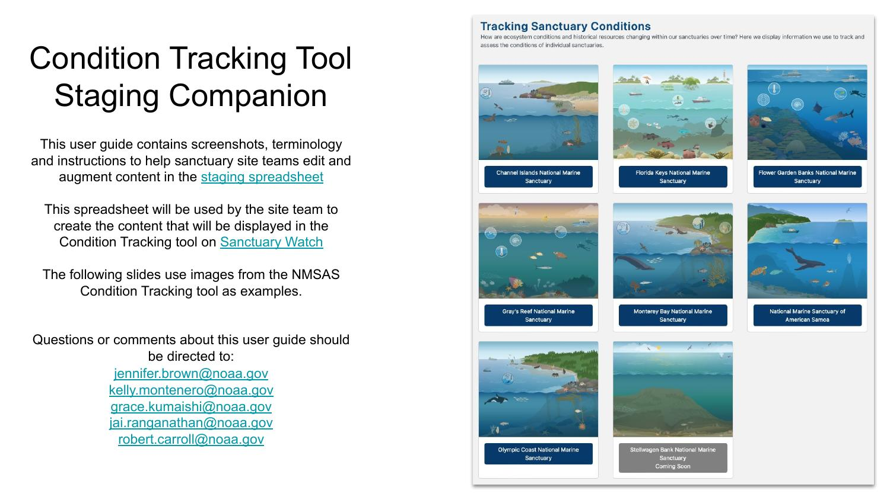

This user guide contains screenshots, terminology and instructions to help teams edit and augment content in the staging spreadsheets.

The following slides use images from the [National Marine Sanctuary of American Samoa Condition Tracking tool](https://sanctuarywatch.ioos.us/american-samoa/nmsas-overview/) as examples.

Questions or comments about this user guide should be directed to:

- jai.ranganathan@noaa.gov
- robert.carroll@noaa.gov

---

## Page 2 — Sanctuary Watch Organization Hierarchy (Overview)

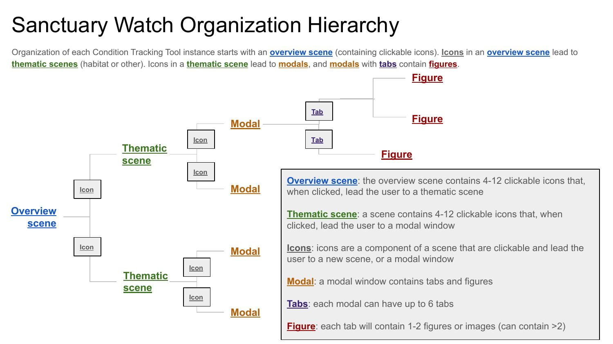

Organization of each Graphic Data instance starts with an **overview scene** (containing clickable icons). **Icons** in an **overview scene** lead to **thematic scenes** (habitat or other). Icons in a **thematic scene** lead to **modals**, and **modals** with **tabs** contain **figures**.

### Definitions

- **Overview scene:** the overview scene contains 4–12 clickable icons that, when clicked, lead the user to a thematic scene.
- **Thematic scene:** a scene contains 4–12 clickable icons that, when clicked, lead the user to a modal window.
- **Icons:** icons are a component of a scene that are clickable and lead the user to a new scene, or a modal window.
- **Modal:** a modal window contains tabs and figures.
- **Tabs:** each modal can have up to 6 tabs.
- **Figure:** each tab will contain 1–2 figures or images (can contain >2).

### Hierarchy Diagram

```
Overview Scene
└── Icon → Thematic Scene
              └── Icon → Modal
                           └── Tab → Figure
                           └── Tab → Figure
```

---

## Page 3 — Sanctuary Watch Organization Hierarchy (Detailed)

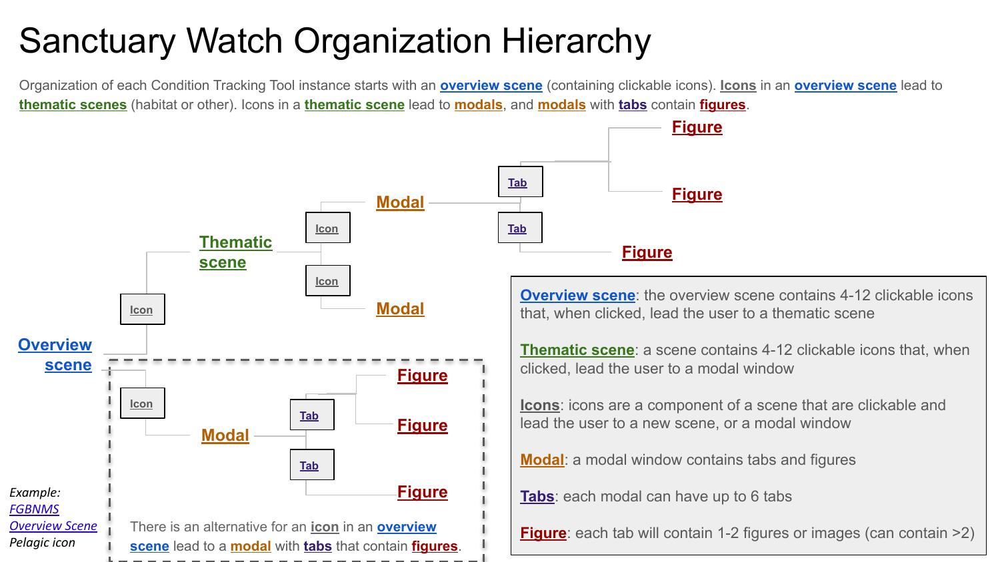

Organization of each Graphic Data instance starts with an **overview scene** (containing clickable icons). **Icons** in an **overview scene** lead to **thematic scenes** (habitat or other). Icons in a **thematic scene** lead to **modals**, and **modals** with **tabs** contain **figures**.

### Definitions

- **Overview scene:** the overview scene contains 4–12 clickable icons that, when clicked, lead the user to a thematic scene.
- **Thematic scene:** a scene contains 4–12 clickable icons that, when clicked, lead the user to a modal window.
- **Icons:** icons are a component of a scene that are clickable and lead the user to a new scene, or a modal window.
- **Modal:** a modal window contains tabs and figures.
- **Tabs:** each modal can have up to 6 tabs.
- **Figure:** each tab will contain 1–2 figures or images (can contain >2).

### Alternative Path

There is an alternative where an icon in an **overview scene** leads directly to a **modal** with **tabs** that contain **figures** (bypassing a thematic scene).

> **Example:** FGBNMS Overview Scene → Pelagic icon → Modal

---

## Page 4 — Overview Scene Example: NMSAS Overview

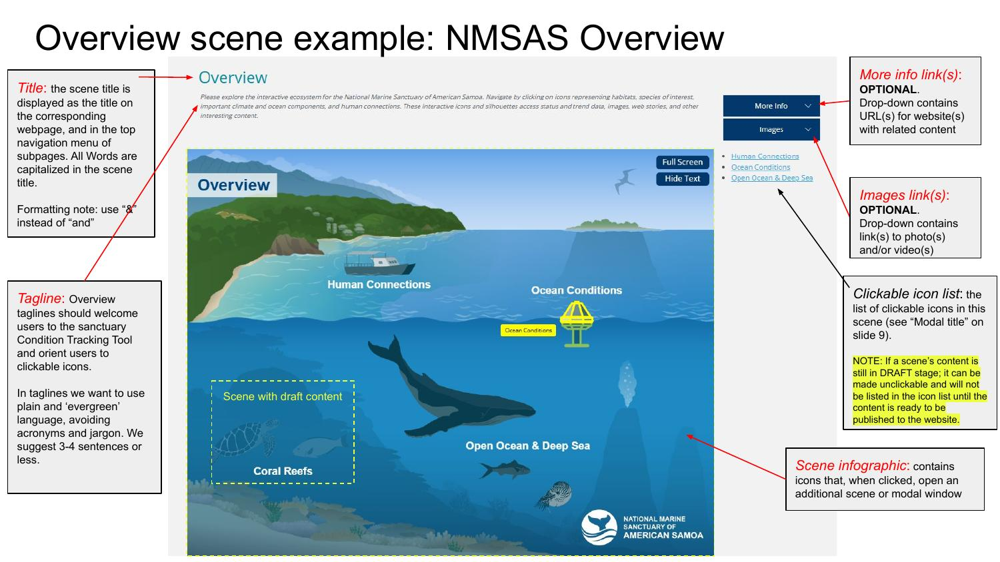

### Component Descriptions

| Component | Description |
|---|---|
| **Title** | Displayed as the title on the corresponding webpage and in the top navigation menu of subpages. All Words are capitalized in the scene title. Formatting note: use "&" instead of "and". |
| **Tagline** | Overview taglines should welcome users to the sanctuary Condition Tracking Tool and orient users to clickable icons. Use plain and 'evergreen' language, avoiding acronyms and jargon. Suggest 3–4 sentences or less. |
| **Scene infographic** | Contains icons that, when clicked, open an additional scene or modal window. |
| **More info link(s)** | OPTIONAL. Drop-down contains URL(s) for website(s) with related content. |
| **Images link(s)** | OPTIONAL. Drop-down contains link(s) to photo(s) and/or video(s). |
| **Clickable icon list** | The list of clickable icons in this scene (see "Modal title" on slide 9). |

> **NOTE:** If a scene's content is still in DRAFT stage, it can be made unclickable and will not be listed in the icon list until the content is ready to be published to the website.

---

## Page 5 — Thematic Scene Example: NMSAS Ocean Conditions

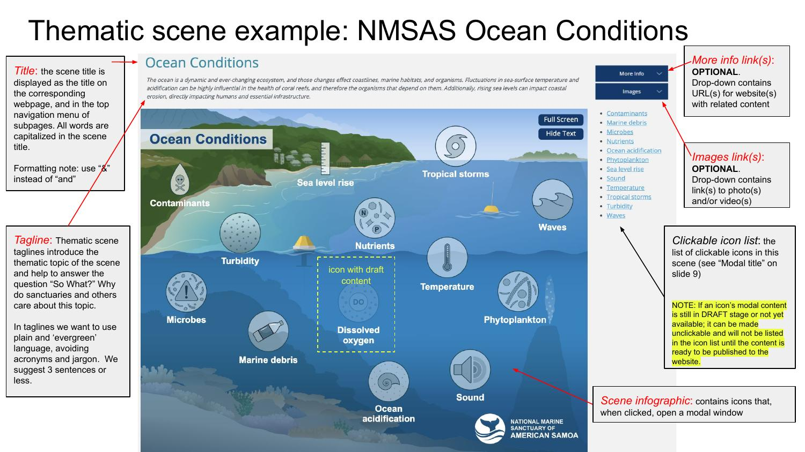

### Component Descriptions

| Component | Description |
|---|---|
| **Title** | Displayed as the title on the corresponding webpage and in the top navigation menu of subpages. All words are capitalized in the scene title. Formatting note: use "&" instead of "and". |
| **Tagline** | Thematic scene taglines introduce the thematic topic of the scene and help to answer the question "So What?" — why do sanctuaries and others care about this topic. Use plain and 'evergreen' language, avoiding acronyms and jargon. Suggest 3 sentences or less. |
| **Scene infographic** | Contains icons that, when clicked, open a modal window. |
| **More info link(s)** | OPTIONAL. Drop-down contains URL(s) for website(s) with related content. |
| **Images link(s)** | OPTIONAL. Drop-down contains link(s) to photo(s) and/or video(s). |
| **Clickable icon list** | The list of clickable icons in this scene (see "Modal title" on slide 9). |

> **NOTE:** If an icon's modal content is still in DRAFT stage or not yet available, it can be made unclickable and will not be listed in the icon list until the content is ready to be published to the website.

---

## Page 6 — Clickable Icon List Options

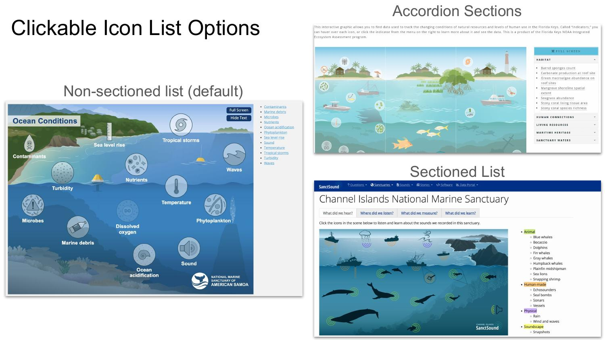

There are three display options for the clickable icon list on the right side of a scene:

### 1. Non-sectioned list (default)
A simple bulleted list of all clickable icon names.

### 2. Sectioned List
Icons are grouped under labeled section headers (e.g., Animal, Human-made, Physical, Soundscape).

### 3. Accordion Sections
Icons are grouped under collapsible/expandable section headers (e.g., HABITAT, HUMAN CONNECTIONS, LIVING RESOURCES, MARITIME HERITAGE, SANCTUARY WATERS).

---

## Page 7 — Sanctuary Watch Content Guidelines: Scene

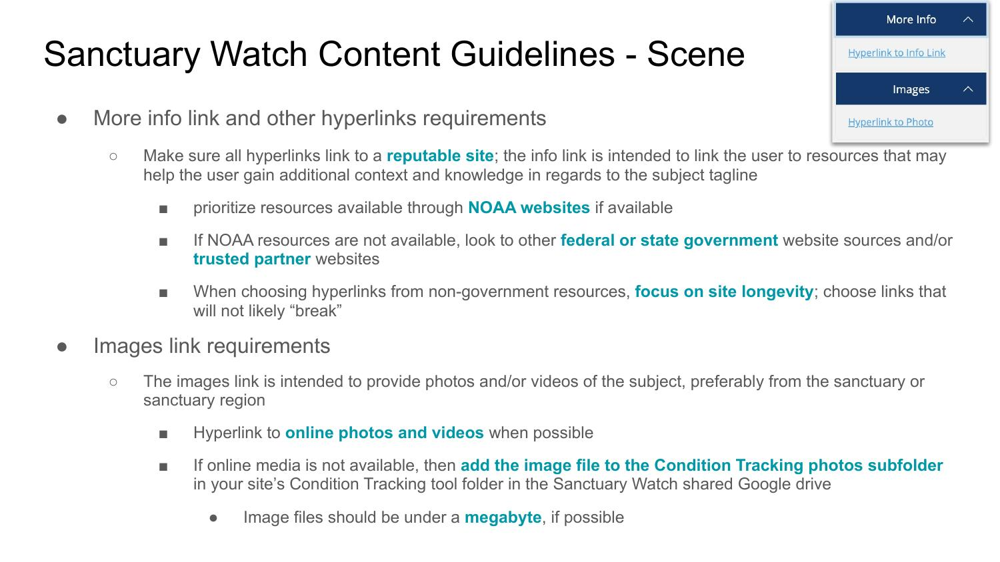

### More Info Link and Other Hyperlinks Requirements

- Make sure all hyperlinks link to a **reputable site**; the info link is intended to link the user to resources that may help the user gain additional context and knowledge in regards to the subject tagline.
  - Prioritize resources available through **NOAA websites** if available.
  - If NOAA resources are not available, look to other **federal or state government** website sources and/or **trusted partner** websites.
  - When choosing hyperlinks from non-government resources, **focus on site longevity**; choose links that will not likely "break."

### Images Link Requirements

- The images link is intended to provide photos and/or videos of the subject, preferably from the sanctuary or sanctuary region.
  - Hyperlink to **online photos and videos** when possible.
  - If online media is not available, then **add the image file to the Condition Tracking photos subfolder** in your site's Condition Tracking tool folder in the Sanctuary Watch shared Google Drive.
    - Image files should be **under a megabyte**, if possible.

---

## Page 8 — Modal Example

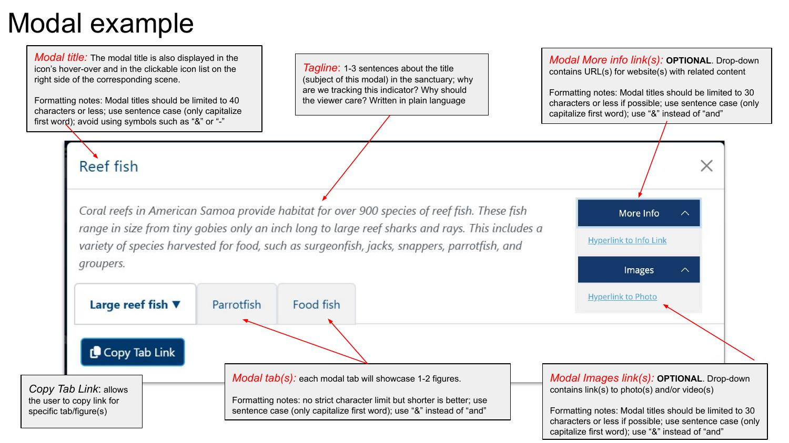

### Component Descriptions

| Component | Description | Formatting Notes |
|---|---|---|
| **Modal title** | Also displayed in the icon's hover-over and in the clickable icon list on the right side of the corresponding scene. | Limited to 40 characters or less; sentence case (only capitalize first word); avoid symbols such as "&" or "-". |
| **Tagline** | 1–3 sentences about the title (subject of this modal) in the sanctuary; why are we tracking this indicator? Why should the viewer care? Written in plain language. | — |
| **Modal More info link(s)** | OPTIONAL. Drop-down contains URL(s) for website(s) with related content. | Limited to 30 characters or less if possible; sentence case; use "&" instead of "and". |
| **Modal Images link(s)** | OPTIONAL. Drop-down contains link(s) to photo(s) and/or video(s). | Limited to 30 characters or less if possible; sentence case; use "&" instead of "and". |
| **Modal tab(s)** | Each modal tab will showcase 1–2 figures. | No strict character limit but shorter is better; sentence case; use "&" instead of "and". |
| **Copy Tab Link** | Allows the user to copy a link for specific tab/figure(s). | — |

---

## Page 9 — Modal Tab in Staging Spreadsheet

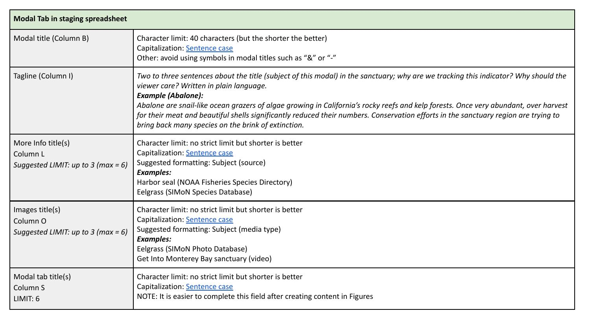

| Field | Column | Guidelines |
|---|---|---|
| **Modal title** | Column B | Character limit: 40 characters (shorter is better). Capitalization: Sentence case. Avoid symbols such as "&" or "-". |
| **Tagline** | Column I | 2–3 sentences about the title (subject of this modal) in the sanctuary. Why are we tracking this indicator? Why should the viewer care? Written in plain language. |
| **More Info title(s)** | Column L | Suggested limit: up to 3 (max = 6). No strict character limit but shorter is better. Sentence case. Suggested format: *Subject (source)*. Examples: *Harbor seal (NOAA Fisheries Species Directory)*, *Eelgrass (SIMoN Species Database)*. |
| **Images title(s)** | Column O | Suggested limit: up to 3 (max = 6). No strict character limit but shorter is better. Sentence case. Suggested format: *Subject (media type)*. Examples: *Eelgrass (SIMoN Photo Database)*, *Get Into Monterey Bay sanctuary (video)*. |
| **Modal tab title(s)** | Column S | Limit: 6. No strict character limit but shorter is better. Sentence case. **NOTE:** It is easier to complete this field after creating content in Figures. |

### Tagline Example (Abalone)

> Abalone are snail-like ocean grazers of algae growing in California's rocky reefs and kelp forests. Once very abundant, over harvest for their meat and beautiful shells significantly reduced their numbers. Conservation efforts in the sanctuary region are trying to bring back many species on the brink of extinction.

---

## Page 10 — Figure Example

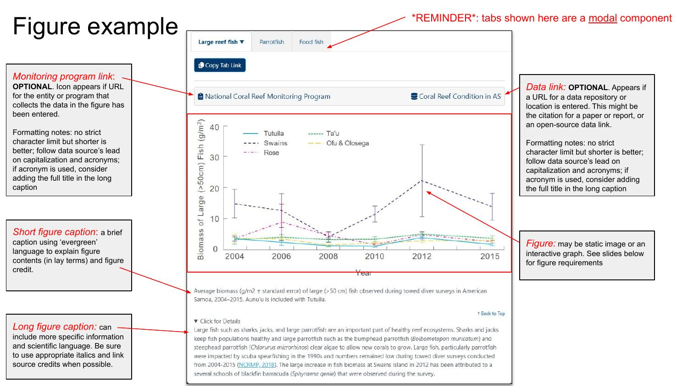

> **REMINDER:** Tabs shown in figure examples are a modal component.

### Component Descriptions

| Component | Description | Formatting Notes |
|---|---|---|
| **Figure** | May be a static image or an interactive graph. See slides below for figure requirements. | — |
| **Short figure caption** | A brief caption using 'evergreen' language to explain figure contents (in lay terms) and figure credit. | — |
| **Long figure caption** | Can include more specific information and scientific language. Be sure to use appropriate italics and link source credits when possible. | — |
| **Monitoring program link** | OPTIONAL. Icon appears if URL for the entity or program that collects the data in the figure has been entered. | No strict character limit but shorter is better; follow data source's lead on capitalization and acronyms; if acronym is used, consider adding the full title in the long caption. |
| **Data link** | OPTIONAL. Appears if a URL for a data repository or location is entered. This might be the citation for a paper or report, or an open-source data link. | No strict character limit but shorter is better; follow data source's lead on capitalization and acronyms; if acronym is used, consider adding the full title in the long caption. |

---

## Page 11 — Figures Tab in Staging Spreadsheet

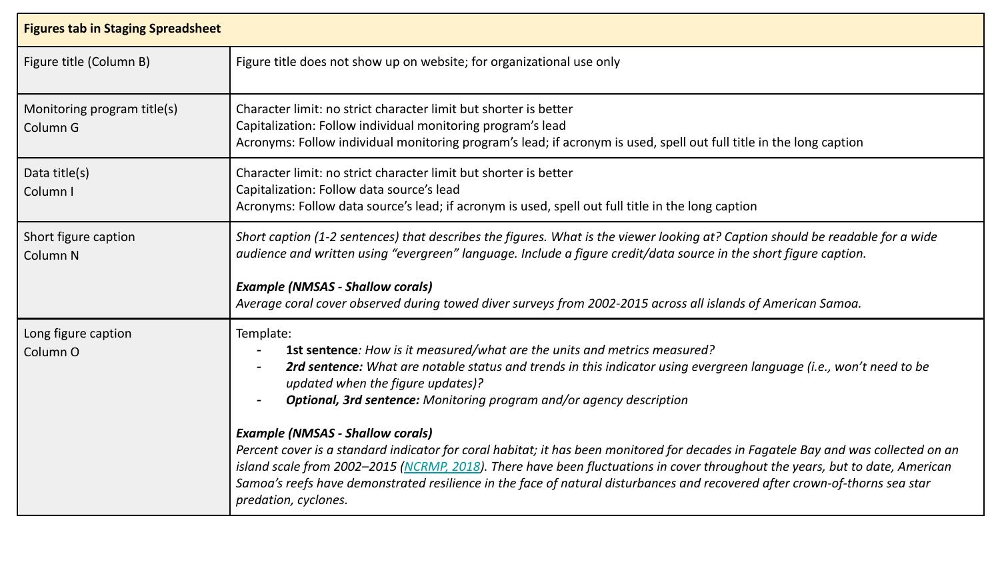

| Field | Column | Guidelines |
|---|---|---|
| **Figure title** | Column B | Figure title does not show up on website; for organizational use only. |
| **Monitoring program title(s)** | Column G | No strict character limit but shorter is better. Capitalization: follow individual monitoring program's lead. Acronyms: follow individual monitoring program's lead; if acronym is used, spell out full title in the long caption. |
| **Data title(s)** | Column I | No strict character limit but shorter is better. Capitalization: follow data source's lead. Acronyms: follow data source's lead; if acronym is used, spell out full title in the long caption. |
| **Short figure caption** | Column N | Short caption (1–2 sentences) that describes the figures. What is the viewer looking at? Caption should be readable for a wide audience and written using "evergreen" language. Include a figure credit/data source. |
| **Long figure caption** | Column O | Template: (1) How is it measured/what are the units and metrics measured? (2) What are notable status and trends in this indicator using evergreen language? (3, optional) Monitoring program and/or agency description. |

### Long Figure Caption Example (NMSAS — Shallow Corals)

> *Percent cover is a standard indicator for coral habitat; it has been monitored for decades in Fagatele Bay and was collected on an island scale from 2002–2015 (NCRMP, 2018). There have been fluctuations in cover throughout the years, but to date, American Samoa's reefs have demonstrated resilience in the face of natural disturbances and recovered after crown-of-thorns sea star predation, cyclones.*

### Short Figure Caption Example (NMSAS — Shallow Corals)

> *Average coral cover observed during towed diver surveys from 2002–2015 across all islands of American Samoa.*

---

## Page 12 — Static Figure Requirements

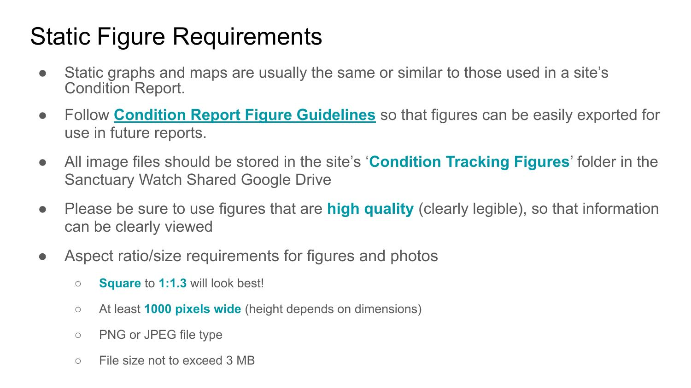

- Static graphs and maps are usually the same or similar to those used in a site's Condition Report.
- Follow **Condition Report Figure Guidelines** so that figures can be easily exported for use in future reports.
- All image files should be stored in the site's **'Condition Tracking Figures'** folder in the Sanctuary Watch Shared Google Drive.
- Please be sure to use figures that are **high quality** (clearly legible), so that information can be clearly viewed.

### Aspect Ratio / Size Requirements

| Requirement | Value |
|---|---|
| **Aspect ratio** | Square to 1:1.3 will look best |
| **Minimum width** | At least 1000 pixels wide (height depends on dimensions) |
| **File type** | PNG or JPEG |
| **Maximum file size** | Not to exceed 3 MB |

---

## Page 13 — Data Requirements for Interactive Figures *(in progress)*

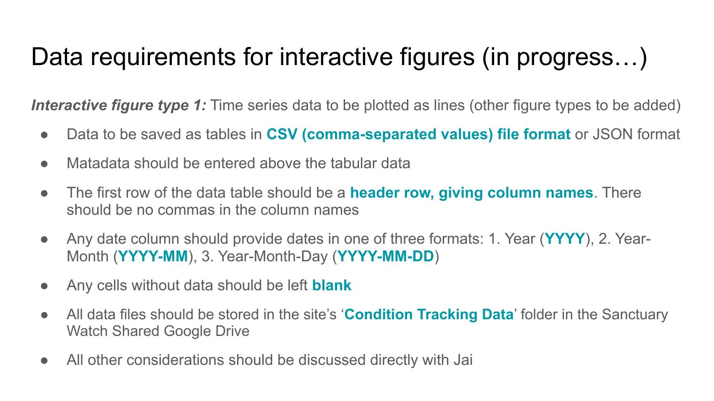

**Interactive figure type 1:** Time series data to be plotted as lines *(other figure types to be added)*

- Data to be saved as tables in **CSV** (comma-separated values) file format or **JSON** format.
- Metadata should be entered above the tabular data.
- The first row of the data table should be a **header row**, giving column names. There should be **no commas** in the column names.
- Any **date column** should provide dates in one of three formats:
  1. Year: `YYYY`
  2. Year-Month: `YYYY-MM`
  3. Year-Month-Day: `YYYY-MM-DD`
- Any cells without data should be **left blank**.
- All data files should be stored in the site's **'Condition Tracking Data'** folder in the Sanctuary Watch Shared Google Drive.
- All other considerations should be discussed directly with Jai.

---

## Page 14 — In-text Citation Recommendations: Short Figure Caption

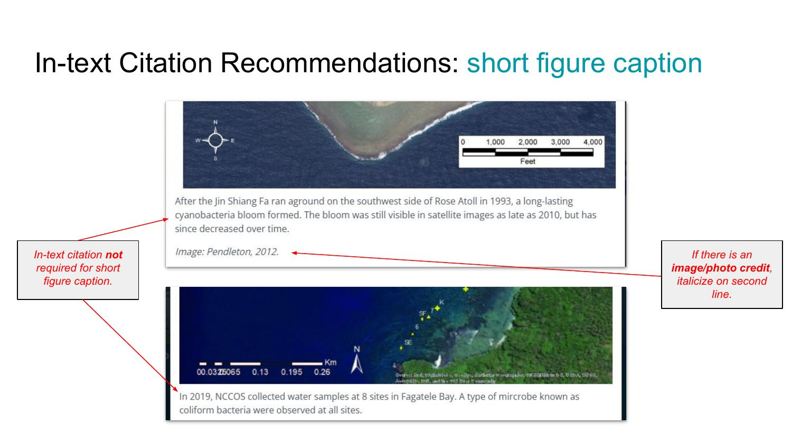

- In-text citation is **not required** for the short figure caption.
- If there is an image/photo credit, **italicize** it on a second line.

### Example

> After the Jin Shiang Fa ran aground on the southwest side of Rose Atoll in 1993, a long-lasting cyanobacteria bloom formed. The bloom was still visible in satellite images as late as 2010, but has since decreased over time.
>
> *Image: Pendleton, 2012.*

---

## Page 15 — In-text Citation Recommendations: Long Figure Caption

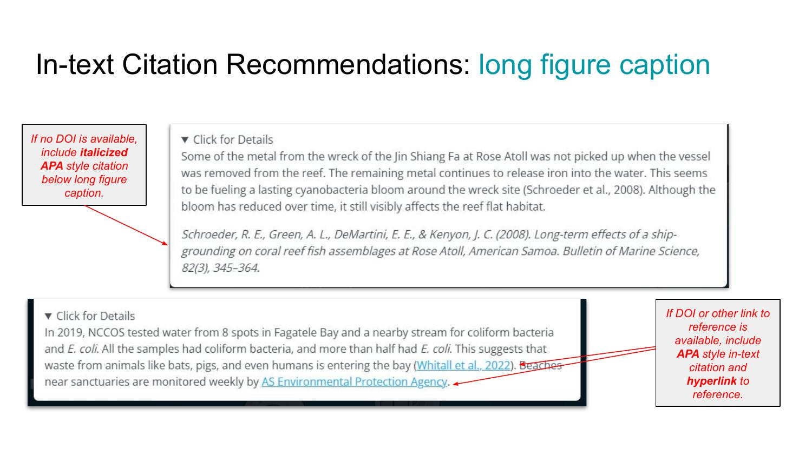

### If No DOI Is Available

Include an **italicized APA style citation** below the long figure caption.

**Example:**

> Some of the metal from the wreck of the Jin Shiang Fa at Rose Atoll was not picked up when the vessel was removed from the reef. The remaining metal continues to release iron into the water. This seems to be fueling a lasting cyanobacteria bloom around the wreck site (Schroeder et al., 2008). Although the bloom has reduced over time, it still visibly affects the reef flat habitat.
>
> *Schroeder, R. E., Green, A. L., DeMartini, E. E., & Kenyon, J. C. (2008). Long-term effects of a ship-grounding on coral reef fish assemblages at Rose Atoll, American Samoa. Bulletin of Marine Science, 82(3), 345–364.*

### If a DOI or Other Link Is Available

Include an **APA style in-text citation** and **hyperlink** to the reference.

**Example:**

> In 2019, NCCOS tested water from 8 spots in Fagatele Bay and a nearby stream for coliform bacteria and *E. coli*. All the samples had coliform bacteria, and more than half had *E. coli*. This suggests that waste from animals like bats, pigs, and even humans is entering the bay ([Whitall et al., 2022](https://doi.org)). Beaches near sanctuaries are monitored weekly by [AS Environmental Protection Agency](https://epa.as.gov).

---

## Page 16 — Staging Spreadsheet: A Collaborative Workspace

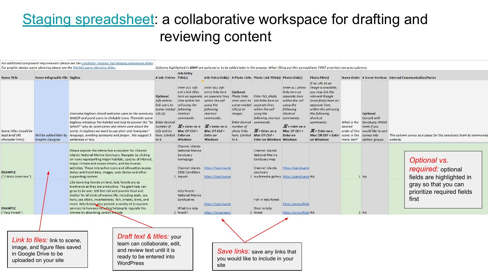

The staging spreadsheet is a collaborative workspace for drafting and reviewing content.

| Feature | Description |
|---|---|
| **Draft text & titles** | Your team can collaborate, edit, and review text until it is ready to be entered into WordPress. |
| **Save links** | Save any links that you would like to include in your site. |
| **Link to files** | Link to scene, image, and figure files saved in Google Drive to be uploaded on your site. |
| **Optional vs. required** | Optional fields are highlighted in gray so that you can prioritize required fields first. |

---

## Page 17 — Transferring Content to WordPress

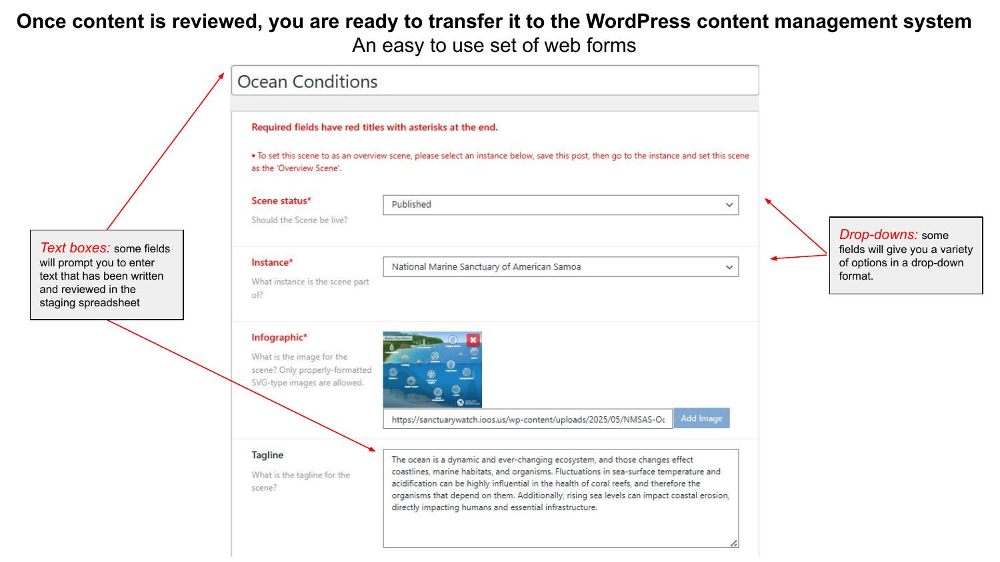

Once content is reviewed, you are ready to transfer it to the **WordPress content management system** — an easy to use set of web forms.

| Feature | Description |
|---|---|
| **Text boxes** | Some fields will prompt you to enter text that has been written and reviewed in the staging spreadsheet. |
| **Drop-downs** | Some fields will give you a variety of options in a drop-down format. |

> Required fields have **red titles with asterisks** at the end.

> To set a scene as an overview scene: please select an instance below, save this post, then go to the instance and set this scene as the 'Overview Scene'.

---

## Page 18 — Interactive Figures: Time Series CSV Format Requirements

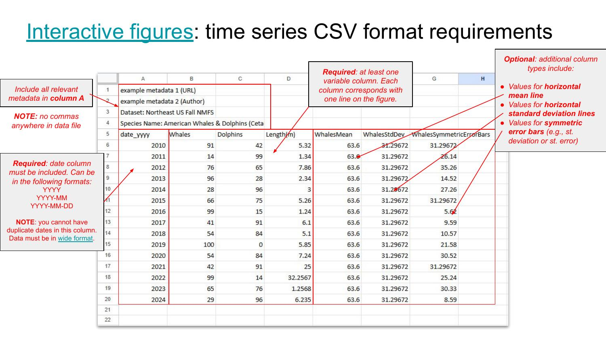

### Column Structure

| Column Type | Required? | Description |
|---|---|---|
| **Metadata (Column A)** | Recommended | Include all relevant metadata above the data table. **No commas anywhere in the data file.** |
| **Date column** | Required | Must be included. Formats: `YYYY`, `YYYY-MM`, or `YYYY-MM-DD`. **No duplicate dates.** Data must be in wide format. |
| **Variable column(s)** | Required | At least one variable column. Each column corresponds with one line on the figure. |
| **Horizontal mean line values** | Optional | — |
| **Horizontal standard deviation line values** | Optional | — |
| **Symmetric error bar values** | Optional | E.g., standard deviation or standard error. |

### Example Table Structure

```
A                                    B       C         D          E           F              G
example metadata 1 (URL)
example metadata 2 (Author)
Dataset: Northeast US Fall NMFS
Species Name: American Whales & ...
date_yyyy   Whales  Dolphins  Length(m)  WhalesMean  WhalesStdDev  WhalesSymmetricErrorBars
2010        91      42        5.32       63.6        31.29672      31.29672
2011        14      99        1.34       63.6        31.29672      26.14
...
```

---

## Page 19 — Interactive Figures: Example 1 — Simple Line Graph (Form)

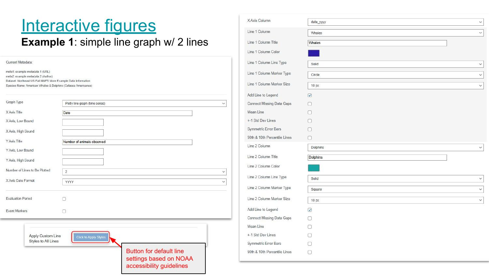

### Form Settings for a Simple Line Graph with 2 Lines

**Left panel (general settings):**

| Setting | Value |
|---|---|
| Graph Type | Plotly line graph (time series) |
| X Axis Title | Date |
| Y Axis Title | Number of animals observed |
| Number of Lines to Be Plotted | 2 |
| X Axis Date Format | YYYY |
| Evaluation Period | ☐ |
| Event Markers | ☐ |

**Right panel (Line 1 — Whales):**

| Setting | Value |
|---|---|
| X Axis Column | date_yyyy |
| Line 1 Column | Whales |
| Line 1 Column Title | Whales |
| Line 1 Column Color | ■ (dark blue) |
| Line 1 Column Line Type | Solid |
| Line 1 Column Marker Type | Circle |
| Line 1 Column Marker Size | 10 px |
| Add Line to Legend | ☑ |
| Connect Missing Data Gaps | ☐ |
| Mean Line | ☐ |
| ±1 Std Dev Lines | ☐ |
| Symmetric Error Bars | ☐ |
| 90th & 10th Percentile Lines | ☐ |

**Line 2 — Dolphins:** Same structure; Color = teal; Marker Type = Square.

> **Button:** "Click to Apply Styles" — applies default line settings based on NOAA accessibility guidelines.

---

## Page 20 — Interactive Figures: Example 1 — Simple Line Graph (Output)

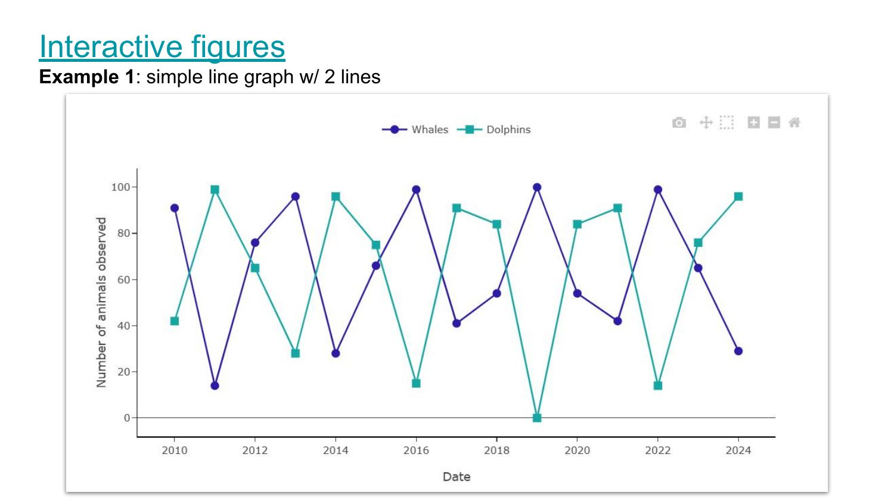

The resulting chart shows a Plotly interactive time series line graph with:

- **X axis:** Date (2010–2024)
- **Y axis:** Number of animals observed (0–100)
- **Line 1:** Whales — dark blue, circle markers, solid line
- **Line 2:** Dolphins — teal/green, square markers, solid line
- Interactive Plotly toolbar in the upper right (camera, pan, zoom, etc.)

---

## Page 21 — Interactive Figures: Example 2 — Mean Line with Error Bars (Form)

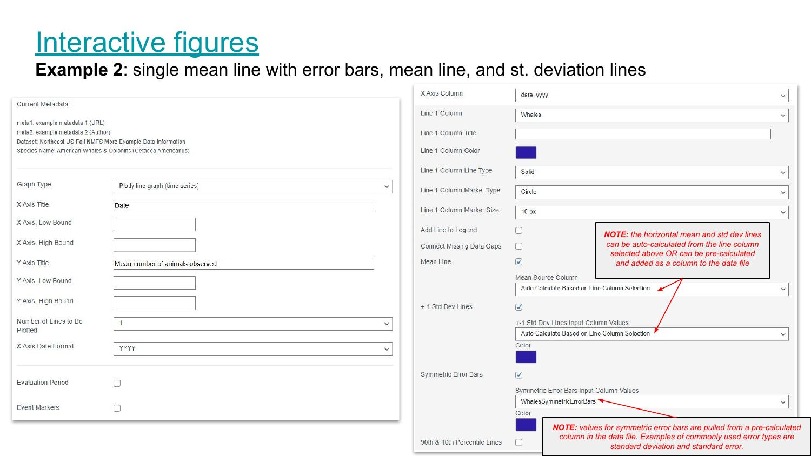

### Form Settings for a Single Mean Line with Error Bars, Mean Line, and St. Deviation Lines

**Left panel (general settings):**

| Setting | Value |
|---|---|
| Graph Type | Plotly line graph (time series) |
| X Axis Title | Date |
| Y Axis Title | Mean number of animals observed |
| Number of Lines to Be Plotted | 1 |
| X Axis Date Format | YYYY |

**Right panel (Line 1 — Whales):**

| Setting | Value |
|---|---|
| X Axis Column | date_yyyy |
| Line 1 Column | Whales |
| Line 1 Column Color | ■ (dark blue) |
| Line 1 Column Line Type | Solid |
| Line 1 Column Marker Type | Circle |
| Mean Line | ☑ |
| Mean Source Column | Auto Calculate Based on Line Column Selection |
| ±1 Std Dev Lines | ☑ |
| ±1 Std Dev Lines Input Column Values | Auto Calculate Based on Line Column Selection |
| Symmetric Error Bars | ☑ |
| Symmetric Error Bars Input Column Values | WhalesSymmetricErrorBars |

> **NOTE:** The horizontal mean and std dev lines can be auto-calculated from the line column selected above **OR** can be pre-calculated and added as a column to the data file.

> **NOTE:** Values for symmetric error bars are pulled from a pre-calculated column in the data file. Examples of commonly used error types are standard deviation and standard error.

---

## Page 22 — Interactive Figures: Example 2 — Mean Line with Error Bars (Output)

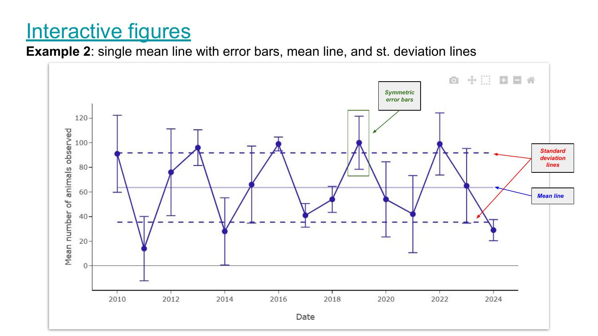

The resulting chart shows:

- **X axis:** Date (2010–2024)
- **Y axis:** Mean number of animals observed (0–120)
- **Main line:** Single data series (Whales) — dark blue, circle markers, solid line
- **Mean line:** Solid horizontal reference line at the overall mean
- **Standard deviation lines:** Dashed horizontal lines at ±1 standard deviation from the mean
- **Symmetric error bars:** Vertical error bars at each data point
